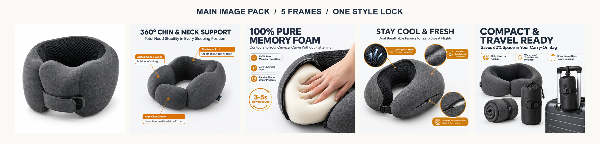
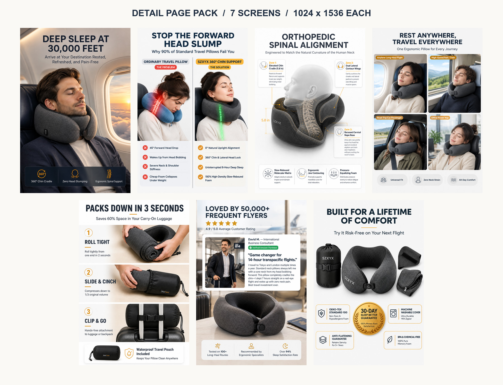
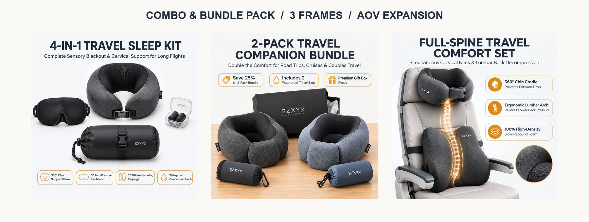

<div align="center">

**English** | [简体中文](./README_zh.md)

# Lumind Product Shot

**Generate high-converting cross-border e-commerce main images and Product Detail Pages (PDP) in one click.**

落落无尘（Luoluo Wuchen）出品 ｜ [https://www.lumind.com.cn](https://www.lumind.com.cn)

[](https://www.python.org/)
[](#)
[](#)
[](https://www.lumind.com.cn)

</div>

---

> **Lumind Product Shot** is an e-commerce image generation tool designed specifically for AI Agents.
>
> You simply tell it "what product you're selling" and "who the target audience is", and it will automatically write English marketing copy, plan the layout structure, and call AI image generation tools to deliver **a complete set of ready-to-publish product images (Main Images + Detail Page Images)**.
>
> It is built and maintained under the **落落无尘（Luoluo Wuchen）** brand.

## Core Features

- **End-to-End One-Click Generation**: Automatically generates 5 main images + 7~9 detail page images (by default) based on simple descriptions, with fully automated delivery.
- **High-Throughput Batch Pipeline**: Process entire prompt directories (`--batch-dir`) or manifest files (`--batch-file`) concurrently with a built-in worker pool (`-c/--concurrency`), auto-sizing detail pages to 1024x1536 and generating structured `batch-summary.json` audit reports.
- **Connection Reuse & Exponential Retries**: Pure standard-library HTTP Keep-Alive connection pooling with exponential backoff on HTTP 429/500/502/503/504 and network drops for resilient cross-border API calls.
- **Visual Consistency Across Images**: Automatically aligns style and product subject to ensure the whole image set has a unified visual identity, eliminating the "patchwork" feel.
- **Conversion-Driven Copy & Structure**: Built-in blockbuster logic, automatically generating authentic English (US) copy tailored for channels like Amazon.
- **Broad Framework Compatibility**: Built for Agents, verified on OpenClaw, Hermes, Codex, Claude Code and WorkBuddy.
- **Brand Style Lock Ready**: Ships a 落落无尘 brand preset (paper-ink base, single accent color, zero emoji, vector icons only) for brand-owned storefronts.

---

## Brand: 落落无尘 / Luoluo Wuchen

This Skill carries the visual discipline of the 落落无尘 brand. The preset is optional and activates when you mention 落落无尘, 格物智境 or lumind.

| Token | Value | Usage |
| --- | --- | --- |
| Warm paper base | `#FBF9F5` | Primary canvas |
| Ink text | `#1f2e41` | Body and headline text |
| Seal red | `#8C241B` | Logo and warning marks only |
| Amber | `#D97706` | The single quantitative highlight |
| Deep sea ink blue | `#11283F` | Decision blocks |
| Icons | Lucide / SVG vector | Zero Emoji is an absolute red line |

Hierarchy is built with font weight and whitespace, not by stacking font sizes.

---

## Real-World Showcase

Sample pack: a 360° pure memory foam neck support travel pillow for Amazon US, generated end-to-end from a single product brief.

**Main image pack — 5 frames, one locked style system**



**Detail page pack — 7 vertical A+ screens, 1024x1536 each**



**Bundle & combo expansion pack — 3 AOV booster shots, 1024x1024 each**



**Read these three facts, not just the images:**
1. **Conversion Core vs. Supporting Structure:** In the 7 detail screens above, the top 3 carrying direct conversion weight are the in-cabin lifestyle hero promise, the side-by-side Pain/Solution comparison matrix (addressing the infamous "head bobbing" issue), and the ergonomic chin/neck support mechanism. The remaining 4 screens build operational trust (multi-scenario versatility, 3-step roll-and-pack guide, 50,000+ customer endorsement card, and full kit with 3-year warranty).
2. **AOV Growth via Bundle Variations:** The 3 combo shots specifically target multi-pack gifting, full-body ergonomics (cervical + lumbar support), and the complete 4-in-1 sleep system (pillow, 3D contoured eye mask, memory foam earplugs, waterproof pouch) to drive higher basket sizes.
3. **Audit Notice:** This pack demonstrates an industrial-grade visual framework. All claims in demo copy (such as specific pricing, trial terms, or clinical endorsements) must be aligned with real vendor specifications before production deployment.

> Full-resolution samples:
> [Hero Main Image](assets/showcase/01-hero-main.jpg) ·
> [Detail Page Hero Screen](assets/showcase/03-detail-hero.jpg) ·
> [AOV Combo Bundle Pack](assets/showcase/05-combo-pack.jpg)

---

## Quick Start

The fastest way in is to let your Agent install and configure the Skill itself — paste the prompt from [Installation, step 0](#installation). Prefer to do it by hand? The manual steps are in the same section.

*(Note: If the API is not configured, the system will only output executable Prompts.)*

**Example Instruction to Agent:**
```text
Use lumind-product-shot to create an Amazon US PDP image pack for this product:
Output 5 main images + 7 detail page images.
```

---

## Installation

**Recommended route: hand it to your Agent.** Paste the block in step 0 into Codex, WorkBuddy or Claude Code, and it clones, configures and verifies the Skill for you. Take the manual route from step 1 only if you prefer doing it yourself, or if your Agent has no network or filesystem access.

### 0. Install by asking your Agent (recommended)

```text
Install the Skill "lumind-product-shot" for me, then prove it works.

1. Clone https://github.com/luobinger/lumind-product-shot.git into the skills
   directory that YOU actually read at runtime (~/.codex/skills/ for Codex,
   ~/.workbuddy/skills/ for WorkBuddy). Do not guess the path - confirm which
   directory you enumerate skills from.

2. If I need the Skill visible to a second host, bridge it with a symlink
   instead of keeping two copies.

3. Prove the install by running scripts/generate_image.py --about and paste the
   raw output. Do not report success just because the folder exists.

4. Then ask me for IMG_BASE_URL, IMG_MODEL and IMG_API_KEY. Write them into
   .env, confirm .env is gitignored, and never echo the key back to me.

5. Restart your session and confirm "lumind-product-shot" appears in your
   available skills list. Tell me plainly if it does not.
```

What a correct result looks like, and when to push back:

| Check | Expected | Push back if |
| --- | --- | --- |
| Install path | a directory inside the host's own skills directory | the Agent wrote it somewhere you do not load skills from |
| Verification | `--about` prints `lumind-product-shot v1.2.0` plus the brand lines | the Agent claims success without running the command |
| Credentials | stored in `.env`, which is gitignored | the key is pasted into the chat or committed |
| Session | the Skill appears in the host's available skills list after a restart | the Agent treats the folder as proof that it loaded |

Two things worth insisting on: verification means the `--about` output, not a created folder; and your API key must never be echoed back into the conversation.

The manual route follows. Every command below was executed against this repository, so you can copy-paste as is.

### 1. Requirements

| Requirement | Version | Note |
| --- | --- | --- |
| Python | 3.10 or newer | `scripts/generate_image.py` imports standard library only — no `pip install` needed |
| Git | any recent version | only for the clone route; the rsync route does not need it |
| An Agent with a skills directory | any | Codex, WorkBuddy, Claude Code, OpenClaw, Hermes, or a plain shell |

```bash
python3 --version
```

The image generation call is a plain HTTPS request built with `urllib`, so there is no dependency tree to break.

### 2. Find the directory your host actually reads

Skills are loaded per host. A folder on disk proves nothing until the host enumerates it.

| Host | Skills directory |
| --- | --- |
| Codex | `~/.codex/skills/` |
| WorkBuddy | `~/.workbuddy/skills/` |
| Claude Code | `~/.claude/skills/` |

Skills are **not** shared across hosts. Installing into `~/.codex/skills/` will not make the Skill visible in WorkBuddy.

### 3. Install

**Route A — clone straight into the skills directory (recommended for updates):**

```bash
mkdir -p ~/.codex/skills
git clone https://github.com/luobinger/lumind-product-shot.git ~/.codex/skills/lumind-product-shot
```

Keeping `.git` inside the skill directory is harmless and lets you update with a single `git pull` later.

**Route B — rsync from a local checkout:**

```bash
cd /path/to/lumind-product-shot
mkdir -p ~/.codex/skills/lumind-product-shot
rsync -a --exclude .git --exclude .env --exclude "generated-images/" ./ ~/.codex/skills/lumind-product-shot/
```

### 4. Install into a second host without keeping two copies

Bridge with a symlink instead of duplicating, so both hosts read the same files:

```bash
mkdir -p ~/.workbuddy/skills
ln -s ~/.codex/skills/lumind-product-shot ~/.workbuddy/skills/lumind-product-shot
```

To install as an independent copy instead, repeat step 3 with the other destination path.

### 5. Verify the install

```bash
python3 ~/.codex/skills/lumind-product-shot/scripts/generate_image.py --about
```

Expected output:

```text
lumind-product-shot v1.2.0
品牌：落落无尘（Luoluo Wuchen）
官网：https://www.lumind.com.cn
标签：lumind / 落落无尘 / Luoluo Wuchen / product-shot / PDP
```

Then **restart the host session** and confirm the Skill appears in the host's available skills list. Do not treat the presence of the directory as proof that it loaded.

### 6. Configure the image API

```bash
cd ~/.codex/skills/lumind-product-shot
cp .env.example .env
```

Edit `.env` and fill in your credentials:

```dotenv
IMG_BASE_URL=https://api.openai.com/v1
IMG_MODEL=gpt-image-1.5
IMG_API_KEY=your-api-key
```

Variable resolution — the first non-empty name wins:

| Setting | Accepted names, in order |
| --- | --- |
| Base URL | `IMG_BASE_URL` → `OPENAI_BASE_URL` → `OPENAI_API_BASE` → `BASE_URL` |
| Model | `IMG_MODEL` → `OPENAI_IMAGE_MODEL` → `IMAGE_MODEL` → `OPENAI_MODEL` |
| API key | `IMG_API_KEY` → `OPENAI_API_KEY` → `API_KEY` |

`.env` lookup order: the path given by `--env-file` if present, otherwise the script walks up from the current working directory until it finds a `.env`. **Real environment variables always take precedence over `.env` values.**

`.env` is gitignored by both `/.env` and `/.env.*` patterns, while `.env.example` is explicitly kept. Never commit real keys.

### 7. Verify the API end-to-end

```bash
cd ~/.codex/skills/lumind-product-shot
python3 scripts/generate_image.py \
  --mode image \
  --prompt "clean ecommerce test frame, white studio background, single matte grey object, centered" \
  --job-dir generated-images/smoke-test \
  --asset-type main \
  --size 1024x1024
```

Success prints `生成完成：` followed by the written file path. If you instead see `图片 API 配置未完整` or `image 模式需要完整图片 API 配置。缺少配置：...`, the credentials did not load — go back to step 6.

### 8. Update and uninstall

```bash
# update a git install
git -C ~/.codex/skills/lumind-product-shot pull

# update an rsync install (--delete removes files deleted upstream; .env is preserved)
rsync -a --delete --exclude .env --exclude "generated-images/" ./ ~/.codex/skills/lumind-product-shot/

# uninstall
rm -r ~/.codex/skills/lumind-product-shot
rm ~/.workbuddy/skills/lumind-product-shot   # if you symlinked it
```

### 9. Command reference

```text
usage: lumind-product-shot [-h]
                           [--prompt PROMPT | --prompt-file PROMPT_FILE | --batch-dir BATCH_DIR | --batch-file BATCH_FILE]
                           [--about] [--mode {auto,prompt,image}]
                           [--job-dir JOB_DIR]
                           [--asset-type {angle,angle-sheet,main,hero,detail,pdp-detail,extra,extras,custom}]
                           [--output-dir OUTPUT_DIR] [--env-file ENV_FILE]
                           [--size SIZE] [--quality QUALITY]
                           [--format {png,jpeg,webp}] [--n N] [--image IMAGE]
                           [--concurrency CONCURRENCY]
                           [--max-retries MAX_RETRIES]
                           [--retry-delay RETRY_DELAY] [--timeout TIMEOUT]
```

| Flag | Value / default | What it does |
| --- | --- | --- |
| `-h`, `--help` | flag | Print the full argument help and exit |
| `--prompt` | string | Pass a Prompt directly. Mutually exclusive with `--prompt-file`, `--batch-dir`, `--batch-file` |
| `--prompt-file` | path | Read a Prompt from a text file |
| `--batch-dir`, `--prompts-dir` | path | Directory with multiple prompt files, executed concurrently in natural sort order |
| `--batch-file`, `--manifest` | path | Batch manifest file (JSON array, JSONL, or line-delimited file paths) |
| `--about` | flag | Print skill name, version and brand lockup then exit, no prompt required |
| `--mode` | `auto` (default) / `prompt` / `image` | `auto` generates image when configured, prints prompt when missing; `prompt` never calls API; `image` requires full config |
| `--job-dir` | path | Root directory for a single run. Writes assets to `<job-dir>/<asset-dir>/`, prompts to `<job-dir>/prompts/`, and audit report to `<job-dir>/batch-summary.json` |
| `--asset-type` | `custom` (default) | Pick the output subdirectory. In batch mode, auto-inferred if file name/folder contains `main`/`detail`/`angle` |
| `--output-dir` | `generated-images` | Legacy flat output directory, only used when `--job-dir` is omitted |
| `--env-file` | path | Point to a specific `.env` file |
| `--size` | `1024x1024` | Requested size. In batch mode, detail pages auto-adapt to `1024x1536` unless explicitly overridden |
| `--quality` | not set | Provider quality param, e.g. `low`, `medium`, `high` |
| `--format` | `png` (default) | `png`, `jpeg` or `webp` |
| `--n` | `1` | Number of images per prompt, must be >= 1 |
| `--image` | path | Product reference image for edits endpoint |
| `-c`, `--concurrency` | `3` (default, 1-32) | Worker thread concurrency for batch processing |
| `--max-retries` | `3` (default) | Maximum retries on 429, 500, 502, 503, 504 or network drops. Set to 0 to disable |
| `--retry-delay` | `2.0` (default, sec) | Base backoff delay in seconds for exponential retries |
| `--timeout` | `120.0` (default, sec) | Network request and download timeout in seconds |

`--asset-type` mapping to subdirectories:

| `--asset-type` | Target directory |
| --- | --- |
| `angle`, `angle-sheet` | `<job-dir>/angle-sheet/` |
| `main`, `hero` | `<job-dir>/main/` |
| `detail`, `pdp-detail` | `<job-dir>/detail/` |
| `extra`, `extras` | `<job-dir>/extras/` |
| `custom` | `<job-dir>/custom/` |

### 10. Recipes

**A. Prompt only — no API key needed**

```bash
python3 scripts/generate_image.py \
  --mode prompt \
  --prompt "premium Amazon main image for a portable blender, clean white background, large product, concise benefit label" \
  --job-dir generated-images/portable-blender-pack-20260509-120000 \
  --asset-type main \
  --size 1024x1024
```

**B. Batch a full pack concurrently from a directory (recommended)**

```bash
JOB="generated-images/travel-pillow-pack-$(date +%Y%m%d-%H%M%S)"

python3 scripts/generate_image.py \
  --batch-dir prompts/ \
  --job-dir "$JOB" \
  --concurrency 3
```

- **Smart Auto-Sizing & Classification**: Automatically sorts prompts in natural order and infers asset types from folder or file names (`main`, `detail`, `angle`); auto-assigns `1024x1536` for detail pages and `1024x1024` for hero/main shots.
- **Connection Pooling & Fault Isolation**: Multi-threaded worker pool shares keep-alive HTTPS connections and retries on transient errors. A failure on one image does not disrupt the rest of the batch.
- **Audit Summary JSON**: Generates `<job-dir>/batch-summary.json` with duration, retries, and output paths for each image.

*Legacy serial loop (preserved for backward compatibility):*
```bash
for f in prompts/main-*.txt; do
  python3 scripts/generate_image.py --prompt-file "$f" --job-dir "$JOB" --asset-type main --size 1024x1024
done
```

**C. Lock product identity from a reference photo**

```bash
python3 scripts/generate_image.py \
  --prompt-file prompts/angle-sheet.txt \
  --image product.png \
  --job-dir "$JOB" \
  --asset-type angle-sheet
```

`--image` switches the request to `/images/edits` and uploads the local file as multipart data. Accepted reference formats: `png`, `jpg`, `jpeg`, `webp`.

**D. Point at an explicit credentials file**

```bash
python3 scripts/generate_image.py \
  --env-file ~/.config/lumind/.env \
  --prompt-file prompts/main-01.txt \
  --job-dir "$JOB" --asset-type main
```

### 11. Troubleshooting

| Symptom | Cause | What to do |
| --- | --- | --- |
| `图片 API 配置未完整，已按 auto 模式只输出 Prompt。` | Credentials incomplete | Finish step 6, or use the Prompt-only output on purpose |
| `image 模式需要完整图片 API 配置。缺少配置：...` | `--mode image` with an incomplete config | Intentional hard fail, so you never silently get Prompts when you asked for images |
| `图片接口返回 HTTP <code>：...` | Provider rejected the call | The response body is printed verbatim. Check model name, size support, quota and key scope. A `502` carrying `connection refused` means your base URL was reached but the upstream behind it is unreachable |
| `无法连接图片接口：...` | Network or base URL | Verify `IMG_BASE_URL` reachability from the same machine |
| `不支持的参考图片格式：.gif，仅支持 png/jpg/jpeg/webp。` | Unsupported `--image` extension | Convert to one of the four accepted formats |
| `参考图片不存在：<path>` | The `--image` path is wrong | Relative paths resolve against the current working directory |
| `无法读取 prompt 文件：...` | The `--prompt-file` path is wrong | Fix the path, or use `--prompt` |
| Prompt saved but no image produced | `auto` mode without credentials | Expected behaviour; see step 6 |
| The host does not list the Skill | Wrong skills directory, or session not restarted | Recheck step 2, fix, then restart the host |

`--size 1024x1536` is not universal. If your provider rejects it, request the closest supported size and adjust your layout accordingly — the Skill's own default detail ratio assumes 2:3.

---

## Use Cases & Workflow

### Zero-Code Natural Language Invocation
Initiate a task conversationally with your AI Agent:

```text
Use lumind-product-shot to generate an Amazon US PDP image pack for this portable blender:
Target audience is fitness and commuting crowds, key selling points are 20-second blending, USB-C charging, portable and leak-proof.
Output 5 main images + 8 detail page images, provide Prompts first; if local API configuration is ready, generate images directly.
```

### Advanced Command Line Invocation

<details>
<summary><b>Click to view more advanced usages</b></summary>

**Output Prompt Strategy File Only:**
```bash
python3 scripts/generate_image.py \
  --mode prompt \
  --prompt "premium Amazon main image for a portable blender, clean white background, large product, concise benefit label" \
  --job-dir generated-images/portable-blender-pack-20260509-120000 \
  --asset-type main \
  --size 1024x1024
```

**Generate Automatically from Preset File:**
```bash
python3 scripts/generate_image.py \
  --prompt-file prompts/main-01.txt \
  --job-dir generated-images/portable-blender-pack-20260509-120000 \
  --asset-type main
```

**Generate Consistency Assets (Product Angle Sheet) Based on Reference Image:**
```bash
python3 scripts/generate_image.py \
  --prompt-file prompts/angle-sheet.txt \
  --image product.png \
  --job-dir generated-images/portable-blender-pack-20260509-120000 \
  --asset-type angle-sheet
```

</details>

---

## Core Engine & Workflow

### Intelligent Execution Pipeline
1. **Multi-Level Context Completion**: Automatically fills in missing information by weight (User Input > Attachment Context > Web Research > Logical Inference > Default Assumptions).
2. **Conversion-Driven Insights**: Intelligently analyzes whether the product is Visual-Driven, Pain-Driven, or Emotion-Value-Driven.
3. **Strategy Card Output**: Generates a `Buyer Reason Card` to set the tone for baseline English copy and core CTAs.
4. **Visual Style Lock**: Establishes a global `Campaign Style Lock` to ensure tight consistency across dozens of images.
5. **On-Demand Direct Delivery**: When user instructions are clear and APIs are ready, directly calls internal scripts to render the complete asset pack.

### Smart Compliance Engine
By default, compliance review is **disabled** to maximize creative freedom. If you request "enable compliance/risk review":
- It strictly filters efficacy promises, medical implications, absolute terms, and improper comparisons.
- Forces data, certifications, sales volumes, and user reviews to have legal, verifiable sources.
- When authentic materials are lacking, it replaces review sections with feature breakdowns / FAQs / scenarios.

### Proactive Inquiry & Fault Tolerance
When core information (like product itself, core audience, target platform) is missing, the Agent will initiate up to 3-5 core questions. If given authorization like "you decide" or "generate quickly," the system automatically engages **assumptions and inference** to continue the flow, highlighting `Assumptions / Defaults Used` at the end to guarantee a smooth process.

---

## Output Delivery Specifications

The system structures a clear task directory for each output, facilitating subsequent manual review and A/B testing:

```text
generated-images/<product-slug>-pack-<yyyymmdd-hhmmss>/
  ├── angle-sheet/  # Temporary product angle baseline images (for consistency control)
  ├── main/         # Main image group (1024x1024)
  ├── detail/       # Detail page long image group (1024x1536)
  ├── prompts/      # Independent execution Prompts for each asset image
  ├── extras/       # Extra variants or fallback images generated by the API
  └── custom/       # Temporary debug and custom generated images
```

### Golden Rules for Image Packs
Whenever "detail page / PDP / main image stack / full set of product images" is mentioned, the Skill defaults to the following delivery model:
- **5 Main Images**: Hero Image (Selling Point) → Mechanism Parsing → Benefit Proof → Scenario Comparison → Offer Guarantee.
- **7-9 Detail Images**: Hero Screen Follow-up → Pain Point Amplification → Mechanism Explanation → Step-by-Step Scenario → Competitor Comparison → Testimonial Endorsement → Risk Reversal (CTA).
- **Independent Prompts** per image, rejecting poor collages, forcing the application of the global Style Lock.

---

## Three Major Conversion Drivers

| Driver Mode | Applicable Scenarios | Strategy Focus |
| --- | --- | --- |
| **Visual-Driven** | Products with strong appearance, texture, gift appeal, and obvious before/after contrast | Extreme visual claims, texture amplification, scenario matching, scannable benefits |
| **Pain-Driven** | Products that solve recurring annoyances, reduce risks, or improve efficiency | Pain point excavation → Mechanism parsing → Benefit proof → Trust endorsement → CTA |
| **Emotion-Value** | Self-expression, sense of belonging, social status, or impulse buys | Emotional hooks, identity narrative, social signal amplification, low-friction guidance |

---

## Limitations
- **Image Generation Boundaries**: Currently supports text-to-image and single product reference image generation; precise local inpainting based on masks is not yet supported.
- **External API Dependency**: Highly dependent on OpenAI-compatible Images APIs. Image quality, coherence, and processing time depend on your configured underlying model (like DALL·E 3 / Flux) and service provider.
- **Conversion Attribution**: This Skill outputs strategy and creative baselines with high conversion potential. Real commercial returns (CTR/CVR/AOV) are still limited by your product strength, market pricing, and traffic acquisition strategies.
- **Unverified On-Image Claims**: With compliance review disabled (the default), generated frames can contain fabricated prices, badges, guarantees, review counts and testimonials. Treat every such element as a placeholder. Replacing them with real, verifiable vendor data before publishing is the seller's responsibility, as is marketplace compliance for Amazon, Shopify or TikTok Shop.

---

## License

Released under the MIT License. Copyright (c) 2026 落落无尘 (Luoluo Wuchen). Full text in [LICENSE](LICENSE).

---

<div align="center">
  <p><b>落落无尘（Luoluo Wuchen）</b> ｜ <a href="https://www.lumind.com.cn">https://www.lumind.com.cn</a></p>
  <p><i>Empowering E-commerce AI Agents with High-Converting Visuals</i></p>
</div>
